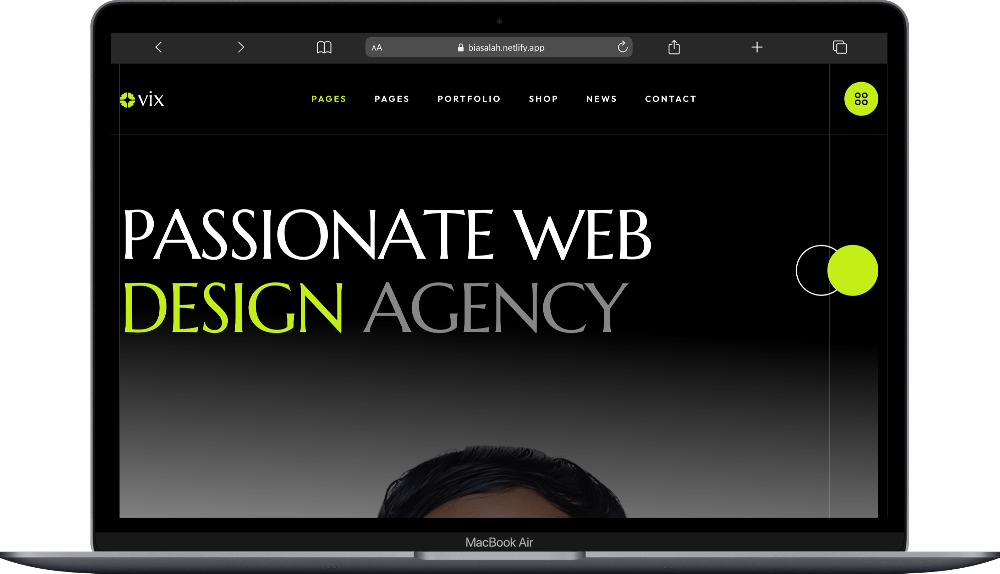
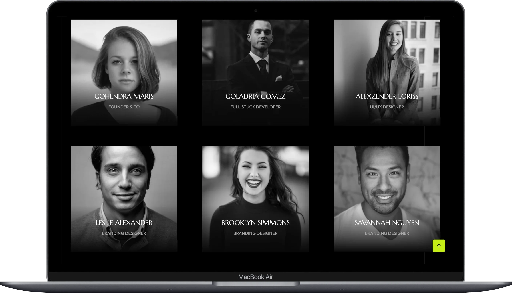

# 🌐 Ovix — Enterprise-Grade Creative Portfolio & Digital Agency Template

[](https://github.com/dresar/PANTEKLAH)
[](https://biasalah.netlify.app)

---

## 📝 Deskripsi Singkat / Short Description

**Ovix** adalah template web portofolio kreatif dan agensi digital modern berbasis HTML5, CSS3/SCSS, dan Bootstrap 5. Template ini dirancang khusus untuk agensi digital, pengembang perangkat lunak, desainer, dan profesional kreatif lainnya untuk memamerkan portofolio mereka dengan visual premium, performa tinggi, dan navigasi yang intuitif.

**Ovix** is an enterprise-grade HTML5 creative portfolio and digital agency website template styled with CSS3/SCSS and Bootstrap 5. It is tailored for digital agencies, developers, designers, and creative freelancers who want to present their works through a visually stunning, high-performance, and fully responsive showcase.

---

## 🧠 AI Summaries (5 Key Insights)

Berikut adalah 5 ringkasan otomatis (AI Summaries) mengenai keunggulan dan struktur teknis dari proyek ini:

1. **🚀 Performance-Optimized Asset Loading**: Website ini mengalihkan semua pemuatan gambar fotografis yang berat ke sistem Content Delivery Network (CDN) premium (Cloudinary & Unsplash). Ini meminimalkan ukuran repositori Git dan memaksimalkan kecepatan pemuatan halaman (low latency).
2. **📱 Adaptive Responsive Design**: Dengan memanfaatkan grid Bootstrap 5 dan flexbox layout, antarmuka situs web ini dirancang sepenuhnya responsif (mobile-first) agar dapat diakses dengan sempurna dari perangkat smartphone, tablet, laptop, hingga layar desktop 4K.
3. **✨ Premium Interactive UI/UX**: Dilengkapi dengan berbagai pustaka animasi modern seperti Swiper.js untuk slider interaktif, Odometer.js untuk animasi counter statistik, serta efek hover gambar dinamis untuk pengalaman pengguna (User Experience) yang berkelas.
4. **🛍️ Multi-purpose Business Pages**: Menyediakan template siap pakai yang lengkap, mulai dari halaman portofolio kreatif, direktori tim, karir/lowongan kerja, blog interaktif, hingga alur toko e-commerce (Product detail, Cart, Checkout) yang responsif.
5. **📂 Modular Scalable Structure**: Memiliki arsitektur kode bersih (clean-code) dengan organisasi file yang modular, di mana kustomisasi styling dapat dilakukan dengan mudah melalui file SCSS terstruktur dan script JavaScript modular.

---

## 🖼️ Tampilan Highlight Website (Showcase Highlights)

Berikut adalah beberapa tampilan halaman utama web **Ovix** yang di-host di [biasalah.netlify.app](https://biasalah.netlify.app):

<p align="center">
  
  <br>
  <i>Halaman Utama Agensi Desain Web Kreatif (Web Design Agency Home Layout)</i>
</p>

<p align="center">
  
  <br>
  <i>Halaman Temukan Pengembang / Pencarian Tim (Find Developers Section Layout)</i>
</p>

<p align="center">
  
  <br>
  <i>Halaman Portofolio Pribadi & Desainer (Personal Portfolio Layout)</i>
</p>

<p align="center">
  
  <br>
  <i>Tampilan Responsif Laptop & Tablet Web Layout</i>
</p>

---

## 🛠️ Stack Teknologi (Technology Stack)

Proyek ini dibangun menggunakan teknologi mutakhir berikut untuk memastikan performa yang cepat, animasi yang mulus, dan kemudahan kustomisasi:

### Frontend Core Stack
- **HTML5**: Struktur semantic untuk SEO terbaik.
- **CSS3 / SCSS**: Styling modular dan kustomisasi variabel warna/desain yang mudah.
- **Bootstrap v5.3**: Framework CSS responsif dan sistem grid modern.
- **JavaScript (ES6+)**: Logika interaksi klien.
- **jQuery**: Memfasilitasi manipulasi DOM dan plugin animasi dengan cepat.

### Animation & Interactivity Plugins
- **Swiper.js**: Slider & Carousel sentuh modern yang dioptimalkan untuk seluler.
- **Animate.css & Magnific Popup**: Efek transisi elemen dan galeri lightbox modal yang cantik.
- **Odometer.js**: Animasi counter angka statistik yang halus.
- **ImageRevealHover**: Transisi gambar interaktif saat kursor diarahkan ke elemen portofolio.

### Media & Asset Delivery Network
- **Cloudinary CDN**: Pengiriman gambar portofolio utama berkinerja tinggi.
- **Unsplash Image API**: Penayangan gambar visual stok/fotografi dinamis berkualitas tinggi secara instan.

---

## 🔍 Detail Project / Project Detail

**Ovix** bukan sekadar halaman statis biasa, melainkan sebuah ekosistem antarmuka web agensi yang lengkap. Terdapat 20 halaman HTML terintegrasi yang mencakup berbagai kebutuhan bisnis digital:

### 1. Halaman Beranda (Homepages)
- **Web Design Agency** (`index.html`): Halaman utama bisnis jasa desain web, agensi branding, dan periklanan.
- **Find Developers** (`home-2.html`): Halaman khusus perekrutan atau agensi penyedia developer.
- **Personal Portfolio** (`home-3.html`): Portofolio pribadi untuk desainer grafis, penulis, pengembang, dan seniman.

### 2. E-Commerce (Shop Pages)
- **Product List** (`shop.html`): Katalog produk yang rapi dengan filter pencarian dan tata letak grid modern.
- **Product Single** (`shop-single.html`): Informasi spesifik produk lengkap dengan ulasan, deskripsi, dan galeri gambar produk.
- **Cart & Checkout** (`cart.html`, `checkout.html`): Halaman keranjang belanja dan formulir penyelesaian pembayaran yang terstruktur.

### 3. Halaman Layanan & Portofolio (Service & Portfolio Pages)
- **Service & Detail** (`service.html`, `service-single.html`): Daftar layanan yang ditawarkan agensi beserta detail spesifikasi layanan.
- **Portfolio & Case Study** (`project.html`, `project-single.html`): Tampilan galeri proyek terbaik agensi dan studi kasus rinci per proyek.

### 4. Blog & Karir (News & Careers Pages)
- **News/Blog & Single** (`blog.html`, `blog-single.html`): Media artikel dan update berita agensi dengan layout interaktif.
- **Career & Detail** (`career.html`, `career-single.html`): Papan pengumuman lowongan kerja dan formulir lamaran detail.

---

## 📂 Struktur Repositori (Repository Structure)

```text
├── assets/
│   ├── css/          # File styling utama (bootstrap.min.css, fontawesome.css, main.css, rs6.css, dll.)
│   ├── fonts/        # Aset font eksternal
│   ├── img/          # Logo lokal, favicon, shape SVG, dan ikon struktural yang tidak diganti CDN
│   ├── js/           # File fungsionalitas (bootstrap.bundle, swiper, odometer, main.js, dll.)
│   └── scss/         # SCSS source code untuk kompilasi kustom
├── aset/
│   ├── gambar/       # Folder tangkapan layar (screenshot) highlight untuk dokumentasi README
│   └── src/          # Source tambahan / template development
├── [20 Halaman HTML] # Halaman index, shop, team, blog, checkout, dll.
└── README.md         # File dokumentasi utama ini
```

---

## 🚀 Panduan Menjalankan & Deployment (Getting Started & Deployment)

### Menjalankan Secara Lokal
1. **Klon Repositori**:
   ```bash
   git clone https://github.com/dresar/PANTEKLAH.git
   cd PANTEKLAH
   ```
2. **Buka Menggunakan Server Lokal**:
   Anda dapat langsung mengeklik file `.html` untuk membukanya di browser, atau menggunakan server lokal agar fungsionalitas JavaScript berjalan mulus:
   - **Node.js**: `npx http-server ./`
   - **Python**: `python -m http.server 8000`

### Cara Deploy ke Hosting Gratis
- **GitHub Pages**: Aktifkan fitur GitHub Pages di tab *Settings* repositori Anda pada branch `main`.
- **Netlify**: Hubungkan repositori GitHub Anda dan pilih deploy langsung tanpa build commands. Situs web Anda langsung online seperti [biasalah.netlify.app](https://biasalah.netlify.app).